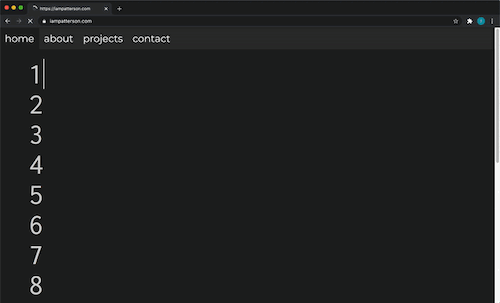

# portfolio-website
When I was tasked with creating a portfolio website, the first thing I did was to google "Web design trends 2020" (please, forgive me for my lack of creativity but we all have to start somewhere). Some of the top results immediately brought something to mind – an IDE! Dark mode; Split screen content; Solid color blocks; Plenty of whitespace; Oversized type and elements; I would use HTML and CSS to recreate the feel of an IDE and JavaScript to bring it to life. Let's go!



## HTML and CSS
I used multiple <span> tags with dedicated classes per line to style the text with CSS as it might appear in an IDE set to dark mode. Instead of typing the text to be displayed between each tags, I set it as the value of a data attribute that I named data-text. This way, I could easily pass the strings to my JavaScript function and manipulate how the text was displayed.

```html
<div id="home">
                <div class="text-container">
                    <div class="hi">
                        &nbsp;1 <span class="typewriter blue" data-text="&lt;div "></span><span class="typewriter lgblue" data-text="id="></span><span class="typewriter orange" data-text="&quot;hi&quot;"></span><span class="typewriter blue" data-text="&gt;"></span><br>
                        &nbsp;2 &ensp;<span class="typewriter blue" data-text="&lt;h1&gt;"></span><br>
                        &nbsp;3 &ensp;&ensp;<span class="typewriter" data-text="I'm "></span><span class="smscreen"><span class="typewriter blue break" data-text="&lt;br&gt;"></span><br>
                        &nbsp;<span class="hide">3</span>&nbsp;&ensp;&ensp;</span><span class="typewriter myName" data-text="Ian Patterson" data-wait="1500" onclick="init()"></span><br>
                        &nbsp;4 &ensp;<span class="typewriter blue" data-text="&lt;/h1&gt;"></span><br>
                        &nbsp;5 &ensp;<span class="typewriter blue" data-text="&lt;button&gt;"></span><br>
                        &nbsp;6 &ensp;&ensp;<a href="#about" class="button">
                            <span class="typewriter" data-text="check me out"></span>
                        </a><br>
                        &nbsp;7 &ensp;<span class="typewriter blue" data-text="&lt;/button&gt;"></span><br>
                        &nbsp;8 <span class="typewriter blue" data-text="&lt;/div&gt;"></span><br>&nbsp;9<br>10<br>11<br>12<br>13<br>14<br>15<br>16<br>17
                    </div>
                </div>
            </div>
```

## JavaScript

To dynamically type out the home page text, the typing function takes two arguments: a html element and a type speed in milliseconds.
The function assigns the string from the data-text attribute to a variable.
To make the function type out the string, I used a self-executing anonymous function inside of a for loop that iterates through all the characters of the string.

For each loop, the self-executing anonymous function takes the iterator as an argument and calls the setTimeout method.
After a delay equal to the iterator multiplied by the type speed, the setTimeout method calls another anonymous function.
This final function takes the character at the index of the iterator and inserts that character in the html element.

This way, the whole string is typed out fluidly one character at a time.

```javascript
function typingFunction(selectedSpan, typeSpeed) {
    if(selectedSpan == undefined || typeSpeed == NaN) {
        return ['',0];
    }
    // get text data from span element
    let txt = selectedSpan.getAttribute('data-text');
    // this loop creates the typing effect
    for(c=0; c<txt.length; c++) {
        (function(c){setTimeout(function(){selectedSpan.innerHTML += txt[c];}, c*typeSpeed);})(c);
    };
    let duration = (txt.length)*typeSpeed;
    // create output for controller to check text output and determine timing
    let outputArray = [txt, duration];
    return outputArray;
};
```
The typing function returns an array to the object that called it, an instance of the myController class (below).
The myController object makes sure the the words are typed out one after another.
Quick side note: I realise that I could've acheived the same thing with a function but, at the time of writing this code, I wanted more practice with classes and this seemed like a fun way of doing that :)
Essentially, when the object is instantiated it calls its type() method which then checks for one or more of three conditions:
1) if the current word has finished being typed, 2) else if the current word has started being typed and 3) else if the entire text has been typed.
Afterwards, the method is called back after a timeout determined by results of the first two conditions unless the entire text has finished being typed.

```javascript
class myController {
    constructor(spansList, wait, typeSpeed) {
        this.spansList = spansList;
        this.index = 0;
        this.wait = parseInt(wait,10);
        this.typeSpeed = parseInt(typeSpeed,10);
        this.isTyping = false;
        this.output = '';
        this.type();
    }
    type() {
        // set pause to default
        let pause = 0;
        // set text check variable to current text
        const current = this.spansList[this.index].getAttribute('data-text');

        // if current text has finished being typed
        if(this.isTyping && this.output[0] == current) {
            // increment index counter
            this.index++;
            // signal to controller that typing has finished
            this.isTyping = false;
            // change pause to set wait time between words
            pause = this.wait;
            // reset output array
            this.output = [];

         // check if current text hasn't started typing
        } else if(!this.isTyping && this.output == '') {
            // signal to controller that typing has started
            this.isTyping = true;
            // remove/add cursor effect
            if(this.index > 0) {this.spansList[this.index-1].classList.remove('cursor')};
            this.spansList[this.index].classList.add('cursor');
            // start typing a new word
            this.output = typingFunction(this.spansList[this.index], this.typeSpeed);
            pause = this.output[1];
        }
        // check if entire text has finished typing
        if(this.index == this.spansList.length) {
            this.spansList[this.index-1].classList.remove('cursor');
            // let myNameChanger know text has finished typing
            TYPING = false;
            // exit
            return;

         // if not, callback
        } else {
            setTimeout(() => this.type(), pause);
        }
    }
}
```
